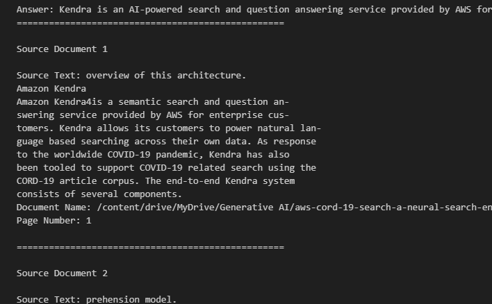
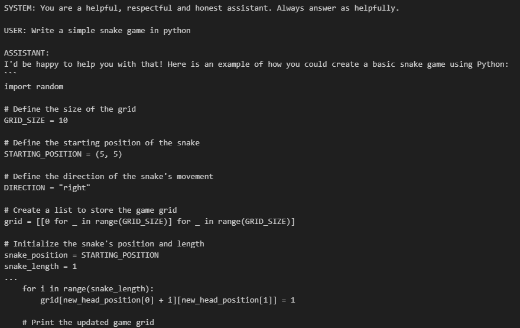

# LLama Experimentation Repository

Welcome to the LLama Experimentation repository! This repository contains two Jupyter Notebook files, **LLama_Experimentation.ipynb** and **LLama_2updated.ipynb**, designed specifically for Google Colab. These notebooks are intended for experimenting with LLama, a tool for querying PDFs stored in Google Drive using langchain and faiss libraries, as well as utilizing the LLama C++ module for downloading and querying the model.

## Prerequisites

Before running the notebooks, make sure you have the required libraries installed in your Colab environment

## File Descriptions

### 1. LLama_Experimentation.ipynb

This notebook utilizes the langchain and faiss libraries to perform QA (Question Answering) with PDFs stored in Google Drive. To execute this notebook, follow these steps:

1. Ensure the required libraries (langchain and faiss) are installed.
2. Download the LLama model from the specified source and place it in the desired location.
3. Provide access to your Google Drive where the PDFs are stored.
4. Run the notebook cells sequentially to perform QA on the PDFs.

## Output

### 2. LLama_2updated.ipynb

This notebook uses the LLama C++ module to download and query the LLama model.
Run the notebook cells sequentially to download the model and perform queries.

## Output

## Note

- **LLama_Experimentation.ipynb** depends on the LLama model being available at the specified location. Make sure the model is correctly downloaded and placed before running the notebook.

Feel free to explore, experiment, and modify the notebooks as needed for your specific use case. If you encounter any issues or have questions, please refer to the documentation of the libraries used or reach out to the maintainers of this repository for assistance.

Happy experimenting with LLama! 🦙
